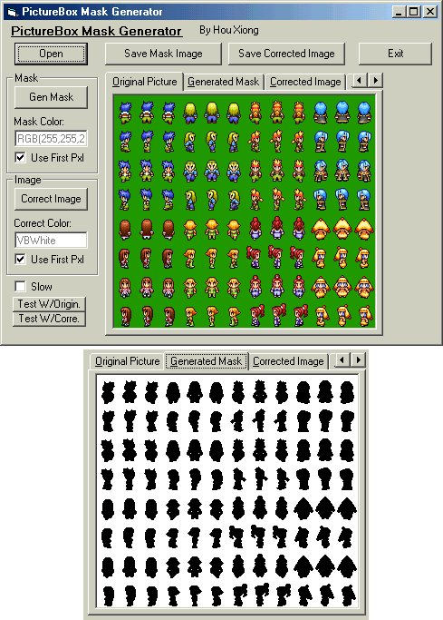



## PictureBox Mask Generator

### Description

I'm not sure if this has been done before, but here it is. This program will automatically generate a mask which you can use with blt'ing transparent images using GDI32 or some others. You can also implement this code into your very own games and never have to make external masks! This is a fully operational program so you could use it to generate and save masks for your games or aplications.
 
### More Info
 
This program deals mainly with the PictureBox control.

The coding may be a little sloppy because I did it in 1 1/2 hours.

Might be a little slow with big images.

             |
---                |---
**Submitted On**   |2003-01-20 11:02:26
**By**             |[Hou Xiong](https://github.com/Planet-Source-Code/PSCIndex/blob/master/ByAuthor/hou-xiong.md)
**Level**          |Intermediate
**User Rating**    |4.0 (12 globes from 3 users)
**Compatibility**  |VB 6\.0
**Category**       |[Graphics](https://github.com/Planet-Source-Code/PSCIndex/blob/master/ByCategory/graphics__1-46.md)
**World**          |[Visual Basic](https://github.com/Planet-Source-Code/PSCIndex/blob/master/ByWorld/visual-basic.md)
**Archive File**   |[PictureBox1532091202003\.zip](https://github.com/Planet-Source-Code/hou-xiong-picturebox-mask-generator__1-42591/archive/master.zip)

